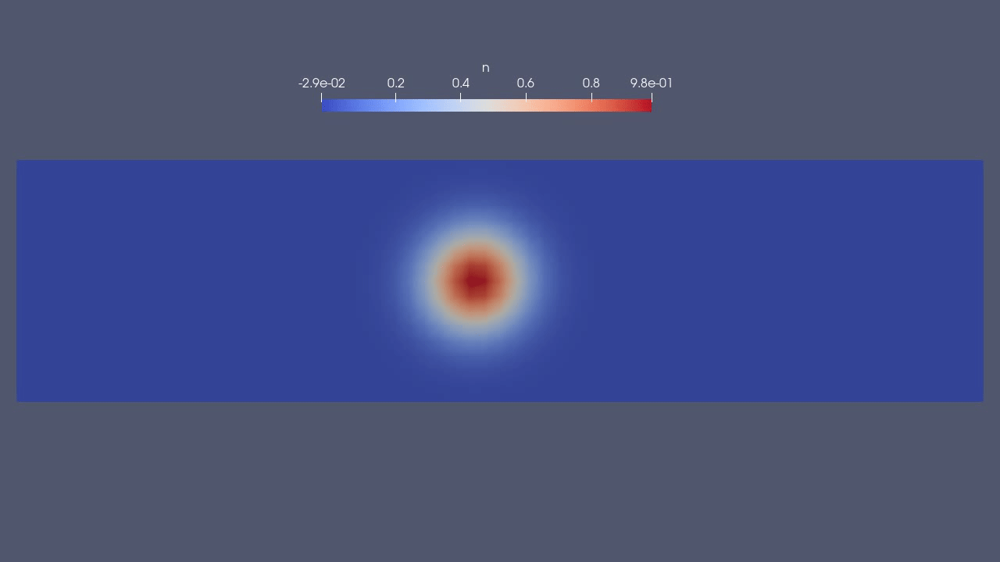
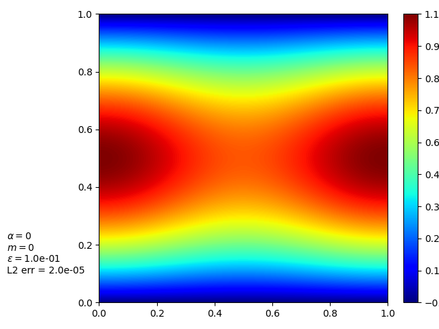
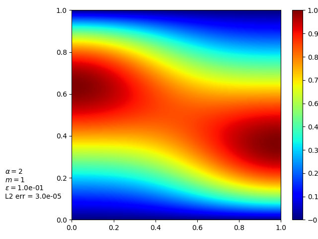
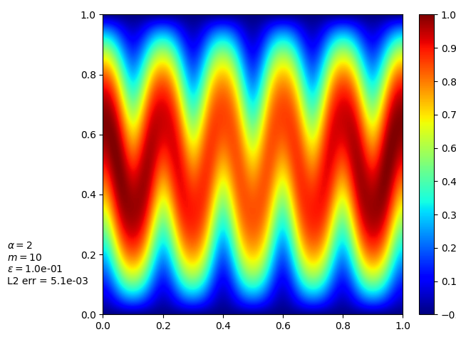

[Home](../readme.md)
# DUNE

## Overview

Description from the [DUNE project page](https://www.dune-project.org/):

> "DUNE, the Distributed and Unified Numerics Environment is a modular toolbox for solving partial differential equations (PDEs) with grid-based methods. It supports the easy implementation of methods like Finite Elements (FE), Finite Volumes (FV), and also Finite Differences (FD)."

## Examples

### CG advection ([simple_advect_periodic_CG.py](examples/simple_advection/simple_advect_periodic_CG.py))

More-or-less working (at least with Gaussian ICs), but:
- Result is out by half a unit
- Needs a much smaller timestep than used in implementations based on other frameworks
- Bizarre bug with the periodic boundary if run **without** MPI - appears to be a gap or ghost region between low-x and high-x boundaries. Can't find a solution in the docs (Or much about PBCs at all...).
### DG advection ([simple_advect_periodic_DG.py](examples/simple_advection/simple_advect_periodic_DG.py))

WIP

### Anisotropic Diffusion ([aniso_diffusion_DeluzetNarski.py](examples/aniso_diffusion/aniso_diffusion_DeluzetNarski.py))

### 1D outflow isothermal compressible Euler ([SOL1D_DG.py](examples/1doutflow/SOL1D_DG.py))

WIP

### Non-conforming mesh ([non-conforming.py](examples/non-conformal_mesh/non-conforming.py))

Attempt to read a non-conforming mesh and run a simple problem. WIP.

The dune-grid interface allegedly supports non-conforming meshes (e.g. section 2. of [this pdf](https://wrap.warwick.ac.uk/146797/2/WRAP-The-DUNE-framework-basic-concepts-recent-development-Dedner-2020.pdf) ).

## Notes

- Using dune-fem module 
- Suggested workflow: develop using python-bindings, then transfer to C++ "for efficiency" (they argue that the interfaces are similar enough to make this trivial).

### Gripes
- Suggested (apt-based) installation on Ubuntu didn't work, at least not easily - couldn't find the dune-pdelab package, which seemed to be essential
- dune.fem tutorials require the latest development version, didn't work with `pip install dune.fem`
- Have to use [DuneGridFormat(.dgf)](https://dune-project.org/doxygen/master/group__DuneGridFormatParser.html) for meshes, although they do have a [converter](https://dune-project.org/sphinx/content/sphinx/dune-fem/gmsh2dgf_nb.html)

### Installation (Ubuntu)

**apt**
- abandoned:
  - core modules installed ok, but not dune-fem
  - needs sudo

**pip**
- core modules easy to install, no sudo needed
- additional (dune-fem, dune-fem-dg etc.) modules easy to install
- *Some* tutorials work out-of-the-box once you have the correct version

### Dependencies
- SciPy
- Eigen (optional)
- PAPI (optional)
- PETSc (optional)
- SIONlib (optional)
- SuiteSparse (optional)

## Links

- [Installation](https://www.dune-project.org/doc/installation/)
- [Core modules on GitLab](https://gitlab.dune-project.org/core/)