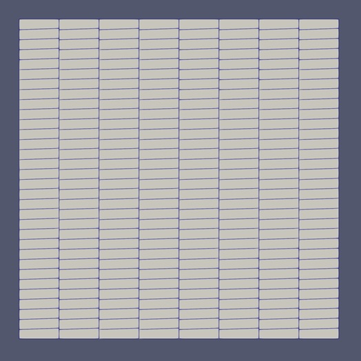
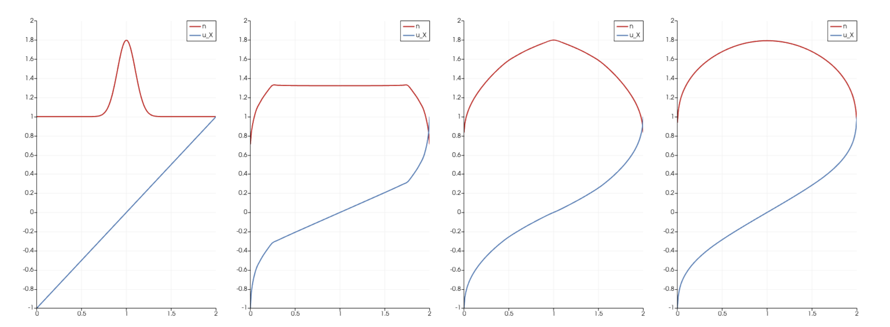

Comparison of FEM frameworks

# Simple tests

# 1. Simple advection (simple_advect_periodic_DG.py)

Advection of scalar field at unit velocity on a periodic domain $40 \times 10$ length units.  Advect left for $40$ time units.  Evaluates L2 error vs analytic profile at end of simulation.\
Discretization: $64 \times 16$ quadrilaterals, order-3 Lagrange polynomial basis functions, discontinuous Galerkin.\
Boundary conditions: all periodic.\
Time-stepper: RadauIIA order-2.\
Initial data: either Gaussian $n=e^{-\frac{r^2}{s^2}}$ or `Frankenstein's monster'-type curve $n=e^{-\frac{a^2}{s^2-r^2}}$ for $r \in (-s,s)$, 0 elsewhere (so-called as it's stitched onto zero with all derivatives continuous everywhere), both centered in the domain.  Both conditions can be made to show Runge phenomenon i.e. overshoots and oscillation with certain choices of parameters (e.g. for Frankenstein, make $a$ small).\
Analytic solution: obviously just the uniformly-advected initial data.\
Other notes: tested with MPI - OK.  Needs Irksome (Runge-Kutta steppers for Firedrake).

# 2. Slab anisotropic diffusion - Deluzet-Narski singular perturbation problem

Anisotropic diffusion problem in a unit square domain, after `A two field iterated asymptotic-preserving method for highly anisotropic elliptic equations'.  Contains anisotropy parameter $\epsilon < 1$ that is the diffusivity in the direction of the magnetic field; in the limit $\epsilon \rightarrow 0$ there is a null space (any function of $y$ satisfying the two Dirichlet BCs is in the solution space).  The problem is (elliptic) anisotropic diffusion:

$$
-\nabla \cdot \left ( A  \nabla n \right ) = f.
%\frac{\partial^2 n}{\partial x^2} + \epsilon \frac{\partial^2 n}{\partial y^2} = - \epsilon.
$$

There is an analytic solution because $f$ is derived using the method of manufactured solutions.

The magnetic fieldlines can be straight (parameters $\alpha=0$, mode number $m=0$) or curved; the paper does straight ones as well as $(\alpha, m)=(2,1)$ and $(2,10)$.

There are two numerical issues: the null space (not really seen in the examples in the paper), and the `locking' problem.  The latter appears when the FEM basis functions lack a component which varies in the direction of the magnetic field - it is thus a problem at low order (basically order-1) and goes away for higher-order.

Discretization: triangle meshes generated by gmsh, edit square.geo to set refinement $h=0.1, 0.05, ... 0.00078125$ as used in the paper (finest mesh is 3.8M elements, fine on laptop), then "gmsh -2 square.geo".  Can also edit script to generate its own quad mesh instead.  First-order CG Lagrange elements.\
Boundary conditions: homogeneous Dirichlet top / bottom, homogeneous Neumann left / right. \
Time-stepper / initial data: none (elliptic problem).\
Analytic solution: $n=\sin(\pi y + \alpha (y^2-y) \cos m \pi x) + \epsilon \cos 2 \pi x \sin \pi y$.\
Other notes: script outputs L2 error so can compare with the figures in the paper.  Done quick test with MPI 4 processes - OK.

# 3. Nonconforming mesh (no script yet)

The Firedrake GitHub discussions (i.e. the help) have informed me that meshes such as the nonconforming example illustrated here are not currently supported.

# 4. 1D outflow isothermal compressible Euler

Evolve compressible Euler (plus spatially-uniform density source) on a 1D domain of $2$ length units.  Evolve initial Gaussian profile for $4$ time units.  Produces file containing time evolution of density and velocity.

Equations are $\dot{n} + (nu)' = 1$ and $\dot{(nu)}+(nu^2)' = -n'$.

Discretization: $200$ equal-size 1D elements, order $N$ CG for velocity and order $(N-1)$ DG for density.\
Boundary conditions: sonic outflow at both ends (velocity is $\pm 1$).\
Time-stepper: Gauss-Legendre order-2.\
Initial data: density Gaussian centered in the domain, velocity linear and sonic outflow at boundaries.\
Analytic solution: not known for time-evolution, final state is $n=1+\sqrt{1-x^2}$, $u=\frac{1-\sqrt{1-x^2}}{x}$.\
Other notes: needs Irksome (Runge-Kutta steppers for Firedrake).  There are other ways to do this problem e.g. using only CG elements with streamline-upwind suppression of numerical oscillations.

