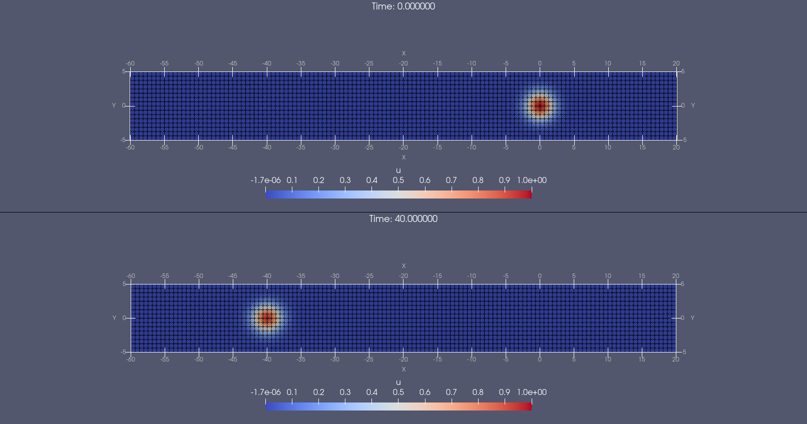
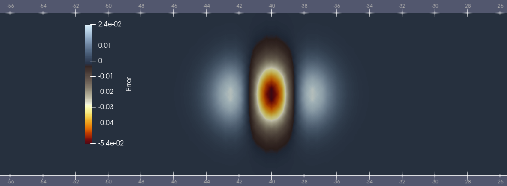
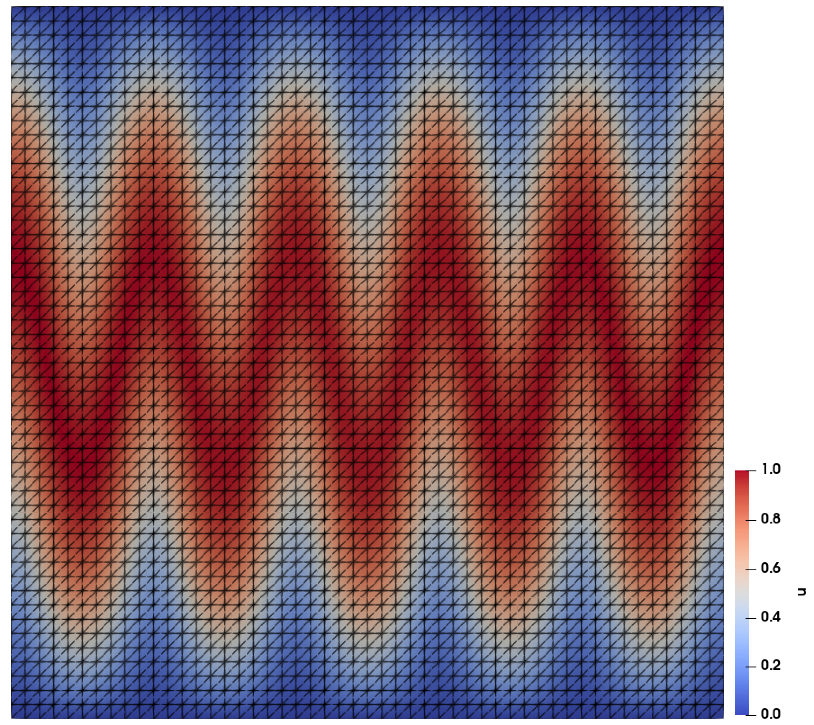

[Home](../readme.md)
# MOOSE

## Overview

Description from the [MOOSE project webpage](https://mooseframework.inl.gov/):

> "The Multiphysics Object-Oriented Simulation Environment (MOOSE) is a finite-element, multiphysics framework primarily developed by Idaho National Laboratory. It provides a high-level interface to some of the most sophisticated nonlinear solver technology on the planet. MOOSE presents a straightforward API that aligns well with the real-world problems scientists and engineers need to tackle."


## Test problems

### Advection

No new code needed default moose app (created via stork script) has all required features - see config file ```advection.i```)

Moose doesn't support periodic bounday conditions for Elemental variables, hence
extended domain doubled size of domain in x direction from [-20,20] to [-60,20]
but element sizes are the same.





#### Caveats
- Second order basis is highest available with quad elements

### Anisotropic Diffusion

See config file  ```diffusion.i```. 
Need to actually write some C++ for this problem. ```AnisotropicDiffusion``` kernel
already exists (have to enable phase_field module in Makefile) but diffusivity is defined via material in ```materials/AnisoDiffMaterial.[C|h]```
Ignoring (quite a lot of) boiler plate then this requires us to define a function
to calculate the diffusivity matrix at each quadrature point.

```
void
AnisoDiffMaterial::computeQpProperties()  {
auto x = _q_point[_qp](0);
auto y = _q_point[_qp](1);
auto b0 = _alpha * (2 * y - 1) * cos(_m*M_PI*x) + M_PI; 
auto b1 = M_PI * _alpha * _m * (y*y - y) * sin(_m*M_PI*x);
auto mod = 1.0/(b0*b0 + b1*b1);
_A[_qp](0,0) = b0 * b0 * mod + _epsilon*(1.0-b0*b0*mod);  
_A[_qp](0,1) = b0 * b1 * mod - _epsilon*b0*b1*mod;  
_A[_qp](1,0) = _A[_qp](0,1);
_A[_qp](1,1) = b1 * b1 * mod + _epsilon*(1.0-b1*b1*mod);
}
```
Similarly we define functions in C++ for the exact solution, and the
RHS function for the ```BodyForce``` kernel, see ```functions/ManufacturedFunction.C|h and functions/Solution.C|h```.

#### Solution

$\alpha = 2.0,\, m = 10.0,\, \epsilon = 0.01,\, L_2 error =  5.14x10^{-3}$



## Notes

To reproduce - create a moose app via the stork script and copy the source files
to the appropriate directories and enable PHASE_FIELD module in Makefile. Adjust
parameters at top of input files.

Terrifying statement from the docs: "MOOSE does not use traditional versioning, is under heavy development, and is being updated continuously. Therefore, it is important that you continue to update MOOSE as you use it to develop your application(s); weekly updates are recommended."

Code is C++17, Python only used for postprocessing, data manipulation, docs generation etc.
Intel compilers NOT supported; gcc (>7.5) and clang (>10.0.1) only.

### Parallelism

- MPI + Threading supported
- GPU via PETSc only.
- Supports (in theory) CUDA, KOKKOS, HIP, OpenCL. SYCL ("Not yet supported")
- Have looked at this for another project will share when written up but..
    - Works on NVIDIA (CUDA or Kokkos), can't make PETSc work on Intel GPUs
      (uses SYCL via KOKKOS), never tried with AMD 
    - Seems to be that not enough work is offloaded to GPU to get speed-up with
      A100 (vs sapphire rapids).


### Dependencies

- PETSc (numerous deps - BLAS, LAPACK, PARMETIS, PTSCOTCH, STRUMPACK , HYPRE, SLEPC, etc.)
- libMesh
- WASP

### Installation

- Has conda install (root not required), but probably not suitable for dev
  - Install miniForge (900 MB)
  - Add INL conda channel
  - Install MOOSE
- From src (create spack package later?)
  - Need to provide MPI, Boost
  - Seems to build petsc,libmesh, WASP ok, but test build failed with missing pyyaml

## Links

- [Examples and Tutorials](https://mooseframework.inl.gov/getting_started/examples_and_tutorials/index.html)
- [GitHub](https://github.com/idaholab/moose)
- [Installation](https://mooseframework.inl.gov/getting_started/installation/index.html)
