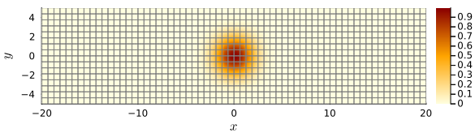
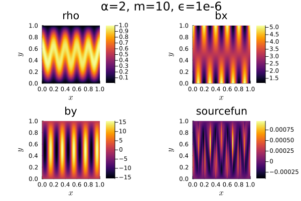

[Home](../readme.md)
# Trixi

## Overview

Description from the [Trixi project page](https://trixi-framework.github.io/Trixi.jl/stable/overview/):

> "Trixi.jl is designed as a library of components for discretizations of
> hyperbolic conservation laws. Trixi.jl uses the method of lines, i.e., the
> full space-time discretization is separated into two steps; the spatial
> semidiscretization is performed at first and the resulting ODE system is
> solved numerically using a suitable time integration method. "

## Notes

- Visualisation with Plots.jl, Makie.jl ("experimental") and Paraview, via Trixi2Vtk.
- Support for various static/adaptive(AMR) meshes in 1D,2D and 3D
   - DG\[SEM\] possible with all.
   - gmsh import only for straight-sided elements or cells
   - MPI limited to some.
- Multi-threading and MPI should be possible (but should test for suitable problems).
- High order integration schemes with various callback types e.g. solution analysis, timestep control, AMR, visualisation.
- Easy to couple with other frameworks, python, fortran, C++ etc. (compiled/partially_compiled julia possible)
- Additional static variables, e.g. magnetic field need to be kept together solution with present semidiscretizations.

### Installation
```julia
julia> using Pkg

julia> Pkg.add(["Trixi", "Trixi2Vtk", "OrdinaryDiffEq", "Plots"])
````
## Links

- [GitHub page](https://github.com/trixi-framework/Trixi.jl)(std)

## Experience with simple test problems

Trixi is primarily designed to solve equations of the form
$$\frac{\partial {\bf U}}{\partial t} + \nabla \cdot {\bf F_{\rm adv}} = {\bf S}$$
where ${\bf F_{\rm adv}}$ are the advective fluxes and ${\bf S}$ contains sources. The framework is designed to be used at a high level, so for a new set of equations one does not need to do much more than defining the fluxes and sources if adapting one of the many examples. Parabolic terms can be included with a hybrid semidiscretization that treats hyperbolic and parabolic differently. A semidiscretization
provides a system of ODEs that are solved using the [OrdinaryDiffEq](https://github.com/SciML/OrdinaryDiffEq.jl) package that is an interface to a large collection of integration schemes. At present, elliptic equations are solved as time-dependent problems (perhaps a new type of semidiscretization could be added to couple with various solvers).

### Advection test

The advection equations are already implemented as ``LinearScalarAdvectionEquation2D`` and provided as convergence tests. You can provide an advection velocity and construct a structured mesh with ``StructuredMesh``. Unfortunately ``RadauIIA3()`` (the integration scheme provided by [OrdinaryDiffEq](https://github.com/SciML/OrdinaryDiffEq.jl)) crashes the code, so `BS3()` is used instead. With purely horizontal advection and a Gaussian of width $2$, at $t=40$ the solution has $L_2$ error of $2.28576555e-04$ and $L_\infty$ error of $2.13218567e-03$.
Changing the advection angle hardly affects the result. The test completes in under $0.5s$ on my desktop. A script is [here](./simple_tests/simple_advect_periodic_DG/simple_advect_periodic_DG.jl). The result can be readily plotted as follows:
```julia
julia> using Plots;
julia> pd = PlotData2D(sol)
julia> plot(pd, seriescolor=:heat)
julia> plot!(getmesh(pd))
```


I was able to use the equation abstraction to have 3 scalar variables, so as to include a 2D-vector field. I could then advect along a spatially-varying static field. This is helpful for the diffusion test.

### Diffusion test

- Initially solved as a *parabolic* problem which is prohibitive for convergence testing, but *hyperbolic diffusion* is more promising (see below).
- Cheated a bit by putting solution in as IC, but easier to check error via existing callback that way. (But also confirmed that converges the same for IC $\rho=\sin(\pi x)\sin(\pi y)$.)
- Used symbolically derived source term retained as a variable that is not updated.
- Magnetic field components also kept as dummy variables.
- With parabolic solve, used dummy hyperbolic equations as well (so to see where other nonlinear or non-conservative terms should be added later).
- MPI working -- speedup of about 3.6 for 4 MPI processes on quad-core desktop (perhaps could have turned off or reduced frequency of non-essential callbacks).


Code: 

[run_aniso_4var.jl](./simple_tests/aniso_diffusion_DeluzetNarski/run_aniso_4var.jl)

Output (32x32 mesh, polydeg=3):


```
────────────────────────────────────────────────────────────────────────────────────────────────────
 Simulation running 'DummyEquations2D' with DGSEM(polydeg=3)
────────────────────────────────────────────────────────────────────────────────────────────────────
 #timesteps:              32814                run time:       1.37539314e+03 s
 Δt:             5.17163308e-05                └── GC time:    1.22266740e+01 s (0.889%)
 sim. time:      2.00000000e+00 (100.000%)     time/DOF/rhs!:  2.19878114e-07 s
                                               PID:            2.36730459e-07 s
 #DOFs per field:         16384                alloc'd memory:        379.708 MiB
 #elements:                1024

 Variable:       rho              bx               by               sourcefun     
 L2 error:       2.93637190e-04   2.49191928e-04   2.47561921e-03   1.00392167e-04
 Linf error:     2.39927502e-03   9.53772137e-04   7.49090885e-03   8.72255532e-04
────────────────────────────────────────────────────────────────────────────────────────────────────
```

#### Hyperbolic diffusion
The hyperbolic equations replace $\nabla u$ (that appears in the diffusive flux) with vector ${\bf G}$, where

$$ \frac{\partial {\bf G}}{\partial t} = \left(\nabla u - {\bf G}\right) / T,$$

where $T$ is some timescale over which the diffusion is hyperbolic. For a steady state the result should be the same as with the elliptic equation. In the hyperbolic solve $T$ can be selected appropriately .

- Need to solve for additional vector field. However, at $64^2$ with lowest order poly, hyperbolic diffusion has timestep around $1/10$ of the parabolic one, and this should scale linearly with number of elements, rather than quadratically.
- In general with this form, BCs implemented directly on flux. In Trixi, advection uses given boundary value to construct correct flux, which for hyperbolic means providing $u$ and its first partial derivatives at the boundary. Since symbolic expressions have been used, there is some additional expense over parabolic solve in this specific example.  
- **TODO** Write down errors for lowest order poly (hyperbolic appear slightly smaller than parabolic at $64^2$).


### Meshes

Trixi can construct structured/unstructured meshes internally. For externally generated meshes there are several options, but for h-nonconforming quad and hex elements with curvilinear coordinates, `P4estMesh` is the only documented interface. This utilises the `p4est` library for parallel AMR, which has also been used in other frameworks such as
deal.II. It supports hanging nodes, but only beyond the initial refinement which is meant to be conforming.
Another interface for [`t8code`](https://dlr-amr.github.io/t8code/) which claims to support whatever you want (e.g. adaptive, hybrid) is WIP, but a lot is working already.

#### P4estMesh input from Gmsh `.geo` file
- Don't think one can use command line `gmsh`, since no option to save boundary nodes. Might be able to use Python API, but opening `.geo` file in gmsh, meshing, then exporting as `.inp` file will work. **N.B. need to checkbox Abaqus save options**. This provides the boundary labels.
- All boundaries must be `Physical Line`, not ~~`Physcal Curve`~~, because the curved boundary information cannot be converted (can use HOHQMesh to do that though if required).
- `Mesh.RecombineAll = 1;` should be set, otherwise quads are not used. I think `Recombine Surface` or another option may be needed in order to make squares explicitly.
- Example square of squares (`squares.geo`, open in gmsh, mesh, then save as `square.inp`):
```gmsh
// Gmsh unit square [0,1]x[0,1]
Mesh.MshFileVersion = 2.2;
h = 0.1;  //refinement factor h
Point(1) = {0.0,0.0, 0.0, h};
Point(2) = {0.0, 1.0, 0.0, h};
Point(3) = {1.0, 1.0, 0.0, h};
Point(4) = {1.0, 0.0, 0.0, h};
Line(1) = {1,2};
Line(2) = {2,3};
Line(3) = {3,4};
Line(4) = {4,1};
Line Loop(8) = {1,2,3,4};
// Settings
// This value gives the global element size factor (lower -> finer mesh)
//Mesh.CharacteristicLengthFactor = 1.0 * 2^(-3);
Mesh.RecombineAll = 1;
Plane Surface(1) = {8};
Transfinite Surface {1};
Recombine Surface {1};
Physical Line(1) = {1};
Physical Line(2) = {2};
Physical Line(3) = {3};
Physical Line(4) = {4};
Physical Surface(1) ={6};
```
- To read in Trixi:
```julia
# polydeg should be same as solver 
boundary_symbols = [:PhysicalLine1, :PhysicalLine2, :PhysicalLine3, :PhysicalLine4]
mesh_file="square.inp"
mesh = P4estMesh{2}(mesh_file, polydeg = polydeg, boundary_symbols = boundary_symbols)
```
   
## Issues, bugs etc.
- Not presently coupled to elliptic solver. Can solve as parabolic problem or [hyperbolic diffusion](https://github.com/trixi-framework/paper-self-gravitating-gas-dynamics).
- Some numerical integrators (esp. implicit ones, such as `RadauII3()`) not working.
- Split hyperbolic/parabolic system requires source terms to be supplied for the hyperbolic one.
- For most meshes, no convenient way of taking numerical derivatives at a high level (e.g. for DN source term)? The exception may be `DGMultiMesh`. Otherwise, automatic derivatives should be possible?
- Extra variables required for magnetic field (but perhaps this is even desirable?).
- Meshes support hanging nodes (perhaps p4est is the the most flexible), but possibly connectivity information is required for locally field-aligned elements?
  
