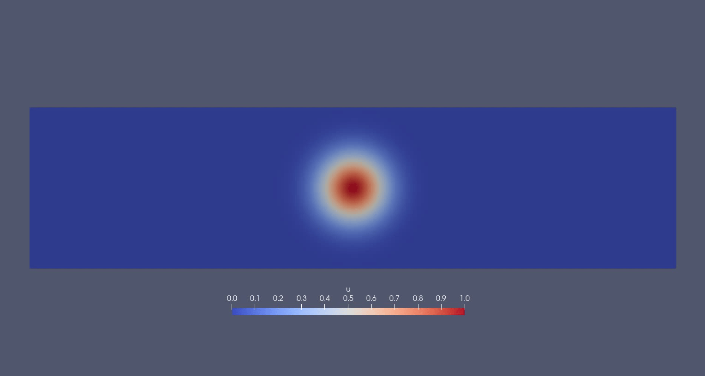

[Home](../readme.md)
# deal.II, life<sup>X</sup>

## Overview
Description from the [deal.II project page](https://fenicsproject.org/):

> "A C++ software library supporting the creation of finite element codes and an open community of users and developers... [which aims] ... to provide well-documented tools to build finite element codes for a broad variety of PDEs, from laptops to supercomputers."

## Examples

### CG advection

WIP

### DG advection ([simple_advect_periodic_DG.cc](examples/advectionDG/simple_advect_periodic_DG.cc))

Works well, but *a lot* of code to do a simple problem (~500 lines).
L2 error at t=40 is 0.00186541.




### Anisotropic Diffusion

WIP
<!-- ### Anisotropic Diffusion ([aniso_diffusion_DeluzetNarski.py](examples/aniso_diffusion/aniso_diffusion_DeluzetNarski.py)) -->

<!-- 

 -->


### 1D outflow isothermal compressible Euler
<!-- ### 1D outflow isothermal compressible Euler ([SOL1D_DG.py](examples/1doutflow/SOL1D_DG.py)) -->

WIP

### Non-conforming mesh
<!-- ### Non-conforming mesh ([non-conforming.py](examples/non-conformal_mesh/non-conforming.py)) -->
WIP


## Notes

### Development Activity / Community
- Lots of PRs into the main code base.
- Many contributors.
- Active mailing list and Google group.
- Approx 2 or 3 releases per year.
- Regular user/developer workshops.

### Documentation
- There is an extensive list of tutorials, covering a wide range of topics.
- The style is quite verbose (lecture-notes-like); a lot of effort is made to explain how different objects interact and what the code is doing behind the scenes.
- Personally, as a developer encountering the codebase for the first time, I found this approach very useful and informative.
- Level of detail could indicate less-than-intuitive API?? Lots of code for Poisson e.g...
- Release notes include a list of "incompatibly" changes that will require changes to application code. 

### Features
- Some Python bindings exist - haven't checked how much of the c++ functionality they cover.
- Sundials (e.g. CVODE) integration
- Some CUDA support
- Some Kokkos support
- Reads gmsh

<!-- 
### General observations
- Enormous codebase -->


### Installation

Many options exist. The spack install takes a long time (installs llvm) and had a minor gotcha, but worked after some tinkering.
Installed via the `spack.yaml` in this dir with:
```
spack env activate . -p
spack install -j 8
```
The advertised "--test=root" option failed for me.

### Gripes
Open pull, closed push, so need an accounr on their gitlab server.
Quite a lot of boilerplate in application code.
Fairly low level API? Based on the first few egs, anyway.

## Links

- [Docs index](https://www.dealii.org/current/index.html)
- [GitHub repo](https://github.com/dealii/dealii)
- [Installation instructions](https://www.dealii.org/current/readme.html)
- [Tutorials](https://www.dealii.org/current/doxygen/deal.II/Tutorial.html)