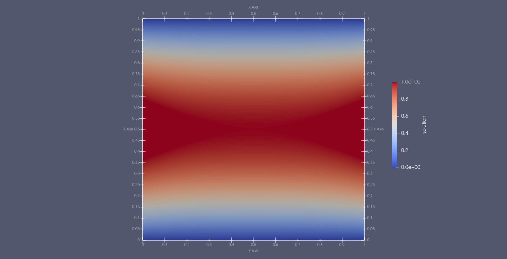
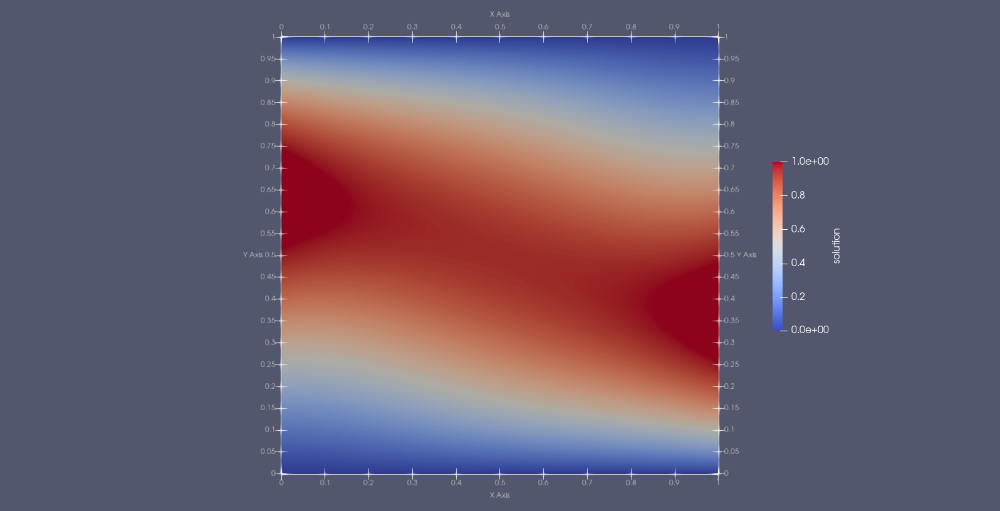
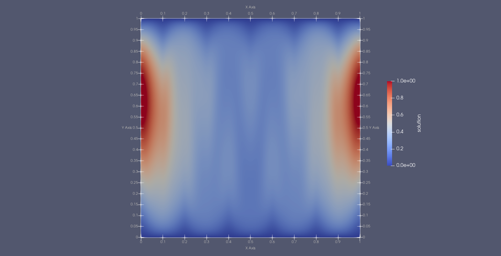

[Home](../readme.md)
# deal.II, life<sup>X</sup>

## Overview
Description from the [deal.II project page](https://fenicsproject.org/):

> "A C++ software library supporting the creation of finite element codes and an open community of users and developers... [which aims] ... to provide well-documented tools to build finite element codes for a broad variety of PDEs, from laptops to supercomputers."

## Review

N.B. The following is based on deal.ii version 9.4.0 (latest version that worked with spack install).

Overall:
 - Mature framework with a large and active development community.
 - Lots of dependencies, but build process for framework and dependent apps is straighforward.
 - Has a Python interface, but coverage is fairly sparse at the moment, so development pace would be C++-limited.
 - C++ API is fairly low level, making it highly configurable, but easy to get wrong and not that intuitive.
 - Already has all the main required features in some form.

### Community
Summary: Mature framework with a large and active development community.

Pros:
- Lots of PRs into the main codebase with many contributors.
- Active mailing list and Google group.
- Approx 2 or 3 releases per year.
- Regular user/developer workshops.

Cons:
- Not aware of any experienced dealii users in-house or among UKAEA collaborators. 

### Ease of development
Summary: Easy to build and get new apps up and running. API is very low level, so it's possible to put together bespoke solvers, but there's *a lot* of boilerplate in doing so.  Some of the numerical methods and parallelisation approaches seemed to require particular storage classes which were not mutually compatible. I found the API to be rather unintuitive, overall.

Pros:
- Supports C++17 and appears to use modern object-oriented patterns throughout.
- Easy to build via spack.
- Easy to create new apps with CMake.
- The low-level API ought to make it easier to put together bespoke solvers.

Cons:
- Lots of dependencies, long build time.
- Lack of high-level functions in the API means a lot of boilerplate code in each app.
- While wrappers for (e.g.) PETSc functions exist, they appear to require there own storage classes that aren't interchangeable with dealii native storage, meaning code needs to be rewritten.
- Similary story for different parallelisation choices - often need to change underlying data structures in order to use them.
- Python interface exists, but doesn't appear to cover much of the functionality.

### Documentation
Summary: Tutorials are useful and include lots of detailed explanation, but tend to be a bit unfocussed, covering too many topics in one go.  My impression is that they have been adapted from some codes that existed anyway, rather than being purpose written.  Arguably the verbosity is only required because the API isn't that intuitive.

Pros:
- Doxygen includes "groups" that includes general discussion of code structure, as well as the usual entity-specific docs.
- Extensive list of tutorials, covering a wide range of topics.
- Style is quite verbose (lecture-notes-like); a lot of effort is made to explain how different objects interact and what the code is doing behind the scenes.
- Release notes include a list of "incompatibility changes" that will require adjustments to application code. 

Cons:
- Tutorials tend to cover too many topics, instead of focussing on one feature or technique.

### Performance
Summary: Performance portability via Kokkos. Coverage seems to be fairly limited, but growing steadily. Matrix free methods exist. Developers claim scalable up to at least 16k cores.

Pros:
- GPU support via Kokkos.
- Matrix free methods exist.
- Wide range of preconditioners via Trilinos and PETSc.

### Numerics and Specific features

Summary: Possible support for higher dimensional problems via ['hyperdeal'](https://github.com/hyperdeal/hyperdeal/tree/master). Build-in particle capability (looks like tracers/markers only). Lots of options for time integration, including CVODE.

Pros:
- Supports CG and DG.
- Supports elliptic solves.
- Sundials (e.g. CVODE) time integration.
- Reads gmsh.
- Higher dimensional problems with ['hyperdeal'](https://github.com/hyperdeal/hyperdeal/tree/master)  (e.g.[3D3V Vlasov-Poisson](https://arxiv.org/abs/2002.08110) ).
- Build-in particle support (tracers/markers only?).
- Cylindrical and spherical polar coords.
- Automatic differentiation (via ADOL-C and Trilinos).
- Symbolic differentiation (via SymEngine).

Cons:
- Supports hanging nodes via handling of refinement levels, but not non-conformal meshes in general.

### Comments on life<sup>X</sup>
life<sup>X</sup> is an extension of deal.ii with modules for modelling the cardiovascular system.
It adds some high level interfaces and wrappers that could simplify development, but I think most of the comments above still apply.
The development team and community associated with life<sup>X</sup> appear to much smaller than those involved with deal.ii itself, so I suspect application developers wouldn't get as much support.


## Examples

For problem descriptions and equations see the [Firedrake examples readme](../Firedrake/examples/readme.md).

### DG advection ([simple_advect_periodic_DG.cc](examples/advectionDG/simple_advect_periodic_DG.cc))

Relatively easy to put together and get working.
Works well, but *a lot* of code to do a simple problem (~500 lines).
L2 error at t=40 is 0.00186541.


### Anisotropic Diffusion ([aniso_diff.cc](examples/anisotropic_diffusion/aniso_diff.cc))

More or less works, but the solutions are quite poor, particularly for the a=2, m=10 case.
Quite a lot of effort was required, even to get to this stage...
It might be possible to get better results with the PETSc solvers but doing so would appear to require a rewrite to accommodate different storage classes.





L2 errors are 0.0362799, 0.0345539 and 0.371597 respectively.

## Installation

Many options exist. The spack install takes a long time (installs llvm) and had a minor gotcha, but worked after some tinkering (encapsulated [here](./spack.yaml)).
Installed via the `spack.yaml` in this dir with:
```
spack env activate . -p
spack install -j 8
```
The advertised "--test=root" option failed for me.

## Links

- [Docs index](https://www.dealii.org/current/index.html)
- [GitHub repo](https://github.com/dealii/dealii)
- [Installation instructions](https://www.dealii.org/current/readme.html)
- [Tutorials](https://www.dealii.org/current/doxygen/deal.II/Tutorial.html)